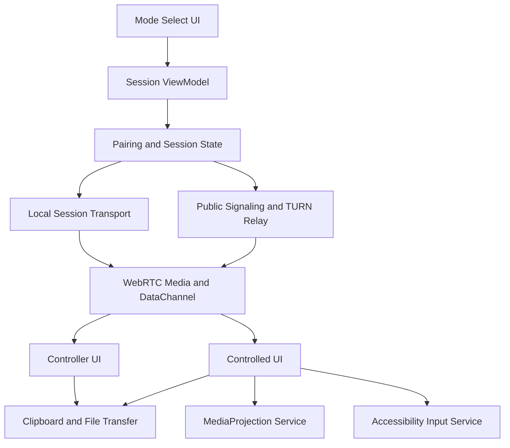

# Android Remote Assist

Feature Name: android-remote-assist
Updated: 2026-08-01

## Description

This feature turns the existing Android project into a consent-based remote assistance app. The current codebase now supports LAN/hotspot mode through an APK-owned local signaling server and cross-network mode through a public signaling service plus TURN relay configuration.

## Architecture

The app keeps UI, session state, media capture, and input injection separated. The controller path renders the remote stream and sends normalized input events. The controlled path exposes screen capture, accessibility input, and foreground-service status.

## Components and Interfaces

- `MainScreen` chooses controller or controlled workflow.
- `MainViewModel` owns session state and lifecycle.
- `SignalingClient` handles pairing and session message exchange.
- `PeerConnectionManager` manages WebRTC peer setup, media tracks, and data channel messaging.
- `LocalSignalingServer` and `LocalSessionDiscovery` provide LAN/hotspot pairing without a fixed backend.
- Public signaling plus TURN relay enables cross-network pairing and media/data relay.
- `ProjectionService` keeps screen capture alive as a foreground service.
- `RemoteAccessibilityService` injects touch, swipe, and key actions.
- `RemoteProtocol` carries touch, key, clipboard, and transfer messages across the data channel.

## Data Models

- `MainUiState`: mode flags, connection state, pairing code, peer identity, error state.
- `SignalingMessage`: session registration, pairing, SDP, ICE, and session control payloads.
- `RemoteInputEvent`: normalized touch, swipe, key, and text commands over the data channel.
- `RemoteClipboardEvent`: clipboard text payload for an active session.
- `RemoteFileTransferEvent`: file metadata, transfer progress, and file chunk payloads for an active session.

## Correctness Properties

- A session begins only after a valid pairing code binds two devices.
- Screen capture starts only after explicit system consent.
- Remote input becomes available only after accessibility permission is active.
- The controlled device always exposes the active sharing state through the foreground notification.
- Session teardown returns the app to an idle state and releases capture and peer resources.

## Error Handling

- Invalid pairing codes surface inline validation feedback.
- Connection failures surface a session error and a retry path.
- Permission denial keeps the app in a safe idle or guided state.
- Peer connection failures close the active transport and return the user to a reconnectable state.
- File transfer failures preserve session state and surface a retryable transfer error.
- Relay configuration failures preserve app state and show connection feedback on the controller screen.

## Test Strategy

- Unit test pairing-code validation and state transitions.
- Unit test remote input encoding and decoding.
- Verify controlled-mode permission banners and controller-mode connect flow in UI tests.
- Verify service lifecycle behavior for screen capture and input service state.
- Verify clipboard and file-transfer protocol encoding and decoding.
- Build a release APK and validate that the installation package is produced successfully.

## References

[^1]: Current project structure observed in `ctrlai/android/app/src/main/java/com/ctrlai/app/*`.
[^2]: `MainViewModel.kt`, `SignalingClient.kt`, `PeerConnectionManager.kt`, `ProjectionService.kt`, `RemoteAccessibilityService.kt`.
