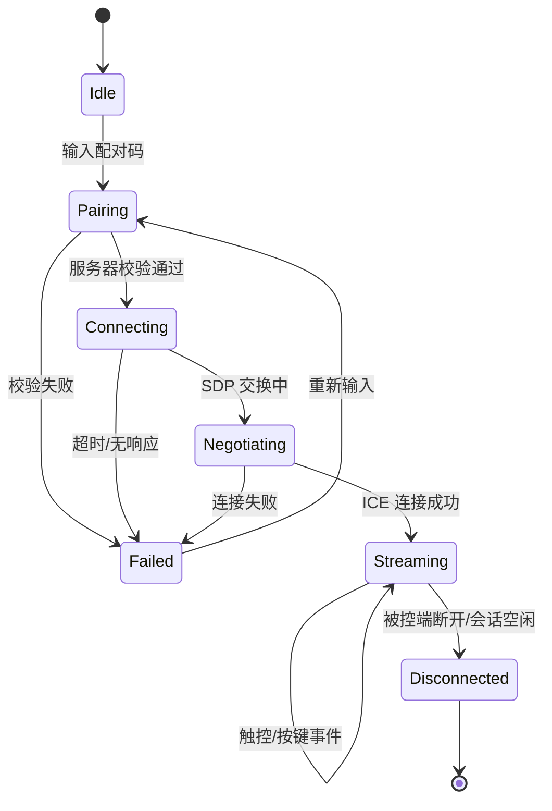

# ctrlai-remote-control Design

Feature Name: ctrlai-remote-control
Updated: 2026-07-31

## Description

ctrlai 是 Android 到 Android 的安全远程控制套件。本设计定义三部分架构：Android 原生应用（Kotlin，双角色：控制端/被控端）、Node.js 信令服务器、以及基于 WebRTC 的端到端加密点对点通道。

核心设计目标：
1. **连接方便**：6 位配对码快速连接，无需账号体系。
2. **安全**：配对码一次性验证 + WebRTC DTLS-SRTP/DataChannel 端到端加密。
3. **界面精美**：Material Design 3，动态取色、深色/浅色自适应。

## Architecture

```mermaid
graph TD
    subgraph "Android Controller"
        C[Controller App]
        C_CAM[Camera Preview / None]
        C_UI[Control UI]
        C_WS[WebSocket Client]
        C_WEBRTC[WebRTC Peer]
        C_UI --> C_WEBRTC
        C_WEBRTC <--> C_WS
    end

    subgraph "Signaling Server (Node.js)"
        S[WS Server]
        S_AUTH[Pairing Auth]
        S_ROOM[Room Manager]
        S_REG[Device Registry]
        S_AUTH --> S_REG
        S_ROOM --> S_REG
        S <--> S_AUTH
        S <--> S_ROOM
    end

    subgraph "Android Controlled"
        D[Controlled App]
        D_MP[MediaProjection]
        D_AS[Accessibility Service]
        D_WS[WebSocket Client]
        D_WEBRTC[WebRTC Peer]
        D_MP --> D_WEBRTC
        D_WEBRTC <--> D_WS
        D_AS <-- Remote Events -->
    end

    C_WS <--> |wss| S
    D_WS <--> |wss| S
    C_WEBRTC <--> |WebRTC E2E| D_WEBRTC
```

架构说明：
- **信令服务器**仅承担配对校验与 WebRTC 协商转发（SDP/ICE），点对点建立成功后退出媒体路径。
- **控制端与被控端**均为同一 Android 安装包，通过入口切换角色。
- 媒体与数据通道均走 WebRTC，DTLS-SRTP 提供端到端加密，无需额外加密层。

## Components and Interfaces

### Android App（`android/`）

| 模块 | 职责 | 关键接口 |
|------|------|----------|
| `app/src/main/java/com/ctrlai/app/MainActivity.kt` | 入口，模式切换（控制/被控） | `setMode(Mode)` |
| `signaling/` | WebSocket 信令客户端 | `connect()`, `sendOffer()`, `sendAnswer()`, `sendIce()` |
| `webrtc/` | PeerConnection 封装，音视频/数据通道 | `startScreenCapture()`, `sendData()` |
| `pairing/` | 配对码生成/校验（被控端） | `generateCode()`, `verifyCode()` |
| `input/` | 远程输入注入（AccessibilityService） | `dispatchTouch(x, y, action)` |
| `capture/` | MediaProjection 屏幕采集 + 编码 | `startProjection()`, `stopProjection()` |
| `ui/` | 全部界面 | Compose 组件 |

核心类：

- `SignalingClient`：封装 OkHttp WebSocket，事件回调（`onPaired`, `onSessionReady`, `onPeerDisconnected`）。
- `PeerConnectionManager`：封装 WebRTC `PeerConnection`，管理视频轨道与 DataChannel。
- `RemoteControlService`（被控端）：前台服务，持有 MediaProjection + AccessibilityService，接收控制事件。
- `ControllerViewModel`（控制端）：管理连接状态机、事件队列、触控坐标换算。

### Signaling Server（`server/`）

| 模块 | 职责 |
|------|------|
| `src/server.ts` | HTTP + WebSocket 入口，优雅停机 |
| `src/room.ts` | 房间/会话管理器，SDP 与 ICE 转发 |
| `src/pairing.ts` | 配对码生成、校验、3 分钟过期、绑定设备指纹 |
| `src/registry.ts` | 在线设备注册表（设备 ID -> socket 连接） |
| `src/config.ts` | 端口、TURN 凭据、日志级别配置 |

协议（JSON over WebSocket）：

```jsonc
// 被控端注册（含配对码）
{ "type": "register", "role": "controlled", "deviceId": "...", "pairCode": "123456", "name": "Pixel 8" }

// 控制端请求连接
{ "type": "connect", "pairCode": "123456", "deviceId": "controller-x", "name": "Nubia" }

// 服务器回复
{ "type": "connected", "remote": { "deviceId": "...", "name": "Pixel 8" } }

// 信令转发
{ "type": "offer", "sdp": "..." }
{ "type": "answer", "sdp": "..." }
{ "type": "ice", "candidate": "..." }
```

### 会话状态机（控制端）



## Data Models

### 信令消息（`SignalingMessage`）

```typescript
interface SignalingMessage {
  type: 'register' | 'connect' | 'connected' | 'offer'
       | 'answer' | 'ice' | 'peer-joined' | 'disconnect' | 'error';
  deviceId?: string;
  pairCode?: string;
  name?: string;
  sdp?: string;
  candidate?: string;
  error?: string;
}
```

### 远程输入事件（`RemoteInputEvent`，经 DataChannel 传输）

```jsonc
// DataChannel 协议：首字节为类型，后随 JSON 载荷
{
  "type": "touch",      // touch | key | text
  "action": 0,          // ACTION_DOWN=0, ACTION_UP=1, ACTION_MOVE=2
  "x": 0.42,            // 归一化坐标 (0..1)
  "y": 0.73,
  "pointerId": 0
}
```

坐标采用 0..1 归一化，配合被控端当前分辨率换算，避免分辨率变化导致坐标偏移。

### 持久化（信令服务器）

- 设备注册表：内存 Map，`deviceId -> { socket, role, name, pairCode, expireAt }`。
- 会话房间：内存 Map，`roomId -> { controller, controlled, state }`。
- 采用内存态保证轻量与无状态重启；如需持久化可接入 Redis（设计预留）。

## Correctness Properties

1. 配对码一次性有效：校验成功后立即失效，不可重放。
2. 配对码 3 分钟过期：`expireAt` 校验失败即拒绝。
3. 点对点连接优先：ICE 候选收集并尝试直连，失败才回退 TURN。
4. 输入坐标边界：`0 <= x,y <= 1`，超出范围的事件丢弃。
5. 会话归属：每房间仅允许一个控制端接入一个被控端，重复连接返回错误。
6. 状态一致性：控制端与被控端状态机均以信令服务器 `connected` 与 DataChannel 打开事件为基准。

## Error Handling

| 错误场景 | 处理策略 |
|----------|----------|
| 配对码错误/过期 | 服务器返回 `error: INVALID_CODE`，控制端展示错误并允许重试 |
| 被控端离线 | 服务器返回 `error: OFFLINE`，控制端提示被控端不在线 |
| WebRTC 直连失败 | 自动重协商并携带 TURN 候选；仍失败则 `error: ICE_FAILED` |
| 被控端拒绝授权 | 被控端返回 `error: REJECTED`，控制端展示被拒绝 |
| 会话空闲超时 | 被控端主动关闭连接，双方回到 Idle |
| 网络中断 | WebSocket 自动重连（指数退避），重连后按状态机恢复或安全退出 |

## Test Strategy

### 信令服务器自动化测试（Vitest）

- `pairing`：配对码生成格式、过期、一次性使用。
- `room`：连接建立、重复控制端拒绝、断开清理。
- `signaling`：SDP/ICE 消息正确转发、非法消息拒绝。
- WebSocket 集成测试：真实连接、错误码返回。

### Android 单元/仪器测试

- `SignalingClient`：消息序列化、错误回调。
- `input`：归一化坐标换算、多点触控事件构造。
- `ControllerViewModel`：状态机迁移正确性。

### 端到端联调

- 两台 Android 真机：连接 → 授权 → 屏幕流 → 触控 → 按键 → 断开全流程。
- 网络环境：局域网直连、跨运营商 NAT（验证 TURN 回退）。

## References

[^1]: (Website) - [WebRTC Official Site](https://webrtc.org)
[^2]: (Android) - [MediaProjection API](https://developer.android.com/media/grow/media-projection)
[^3]: (Android) - [AccessibilityService](https://developer.android.com/reference/android/accessibilityservice/AccessibilityService)
