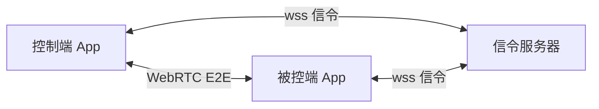

# ctrlai

Android 到 Android 的安全远程控制套件。

- **连接方便**：6 位配对码快速连接，无账号门槛。
- **安全**：配对码一次性验证 + WebRTC DTLS-SRTP / DataChannel 端到端加密。
- **界面精美**：Material Design 3，动态取色，深色/浅色自适应。

## 架构



- 控制端与被控端为**同一 Android 安装包**，通过入口切换角色。
- 信令服务器（Node.js）仅负责配对校验与 SDP/ICE 转发，点对点建立后退出媒体路径。
- 媒体与数据通道全部走 WebRTC，端到端加密。

## 目录结构

```
ctrlai/
├── android/        # Android 原生应用（Kotlin, Compose）
└── server/         # Node.js 信令服务器（TypeScript）
```

## 需求与设计

见 `.monkeycode/specs/ctrlai-remote-control/`：
- `requirements.md` — EARS 规范需求文档
- `design.md` — 技术设计规格说明书

## 快速开始

### 信令服务器

```bash
cd server
npm install
npm run dev
```

默认监听 `0.0.0.0:8080`，WebSocket 路径 `ws://<host>:8080/ws`。

### Android App

使用 Android Studio 打开 `android/` 目录，运行到两台 Android 真机（Android 7.0+）。

1. 被控端：选择「被控模式」，授权屏幕录制与无障碍服务，获取 6 位配对码。
2. 控制端：选择「控制模式」，输入配对码连接，授权后开始远程控制。
